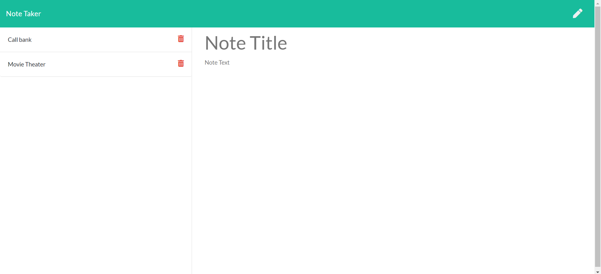

# Note Taker

## Description

For this challenge, I was tasked with creating an application called Note Taker that can be used to write and save notes.
The app uses an Express.js back end and will save and retrieve user generated note data from a JSON file.

The application’s front end has already been created. It's my job to build the back end, connect the two, and then deploy the finished application to Heroku.

### Website Link
Check out the deployed app here: [Note Taker](https://note-taker-ch-626d3d94d81c.herokuapp.com/)

### Screenshots

### Contact

[Felipe Ursini on GitHub](http://github.com/usflfelipe)